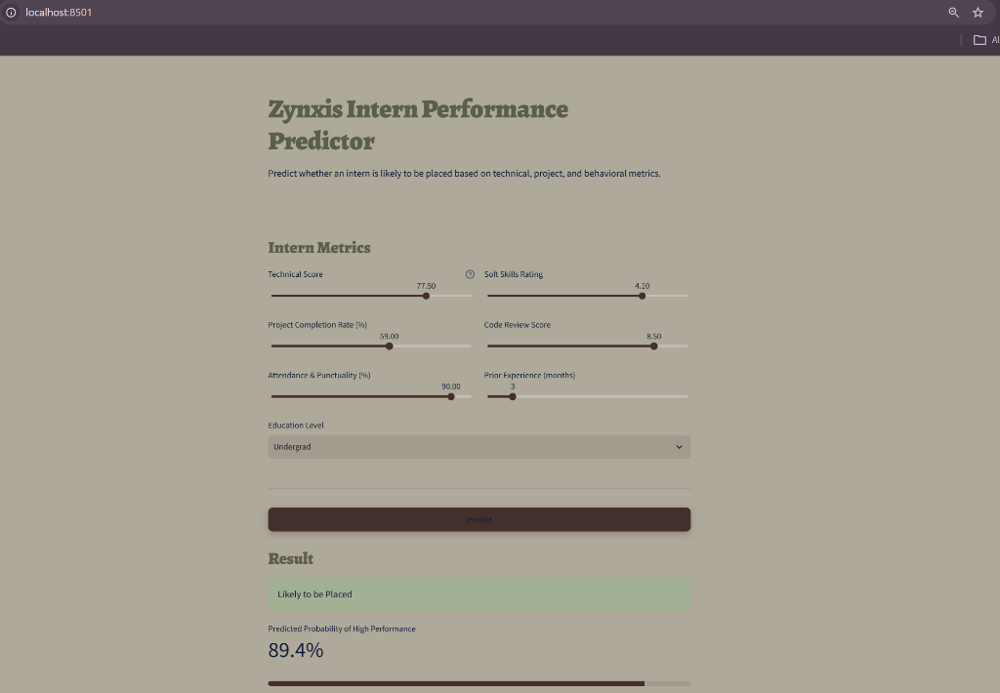

# Zynxis Intern Performance Predictor — Week 7 Deployment

A Streamlit web app that serves the Week 3 Random Forest classification model,
predicting whether an intern will be a high performer / get placed based on
technical, project, and behavioral metrics.



## Model

- **Algorithm**: Random Forest Classifier (`n_estimators=100`, `max_depth=7`, `min_samples_split=4`)
- **Source**: Week 3 notebook (`classification_model.ipynb`)
- **Test performance**: 69% accuracy, F1 = 0.75, ROC-AUC = 0.71
- **Features**: Technical_Score, Project_Completion_Rate, Attendance_Punctuality,
  Soft_Skills_Rating, Code_Review_Score, Prior_Experience_Months, Education_Level
  (one-hot encoded: High_School / Undergrad / Grad)

## Project Structure

```
zynxis_deployment/
├── app.py                          # Streamlit app
├── train_model.py                  # Reproduces the Week 3 pipeline, saves model artifacts
├── zynxis_intern_performance.csv   # Training data (500 rows)
├── classification_model.ipynb      # Original Week 3 notebook
├── app_screenshot.png              # UI preview screenshot
├── requirements.txt
├── README.md
├── .streamlit/
│   └── config.toml                 # Streamlit theme config
└── (generated after running train_model.py)
    ├── best_model_random_forest.pkl
    ├── scaler.pkl
    └── feature_names.pkl
```

## Setup & Run Locally

```bash
# 1. Create a virtual environment (recommended)
python -m venv venv
source venv/bin/activate        # Windows: venv\Scripts\activate

# 2. Install dependencies
pip install -r requirements.txt

# 3. Train the model (generates the .pkl artifacts the app needs)
python train_model.py

# 4. Launch the app
streamlit run app.py
```

The app will open at `http://localhost:8501`.


## What the App Does

- Presents sliders/dropdowns for all 7 input features with sensible ranges taken
  directly from the dataset's documented bounds.
- On "Predict", encodes and scales the input exactly as done at training time,
  runs it through the saved Random Forest model, and displays:
  - A clear High Performer / Needs Support verdict
  - The predicted probability, with a progress bar
  - An expandable view of the exact feature row sent to the model
- Handles missing model artifacts gracefully with an on-screen error instead of crashing.
